# moba034na.github.io

[home](https://moba034na.github.io/)

[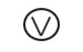](href "電圧記号")

[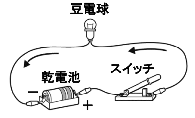](href "直列豆電球")
[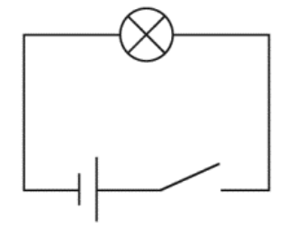](href "豆電球回路図")
[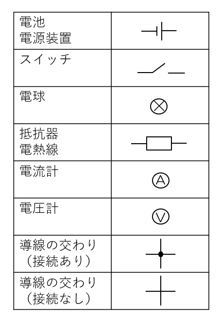](href "電気用図記号")
[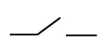](href "スイッチ")
[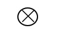](href "電球")
[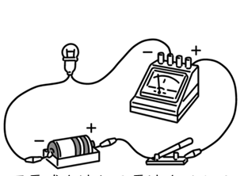](href "豆電球電流計")
[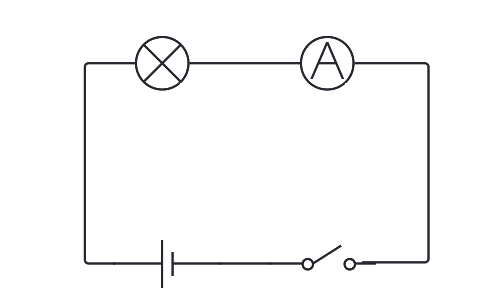](href "電流計回路図")
[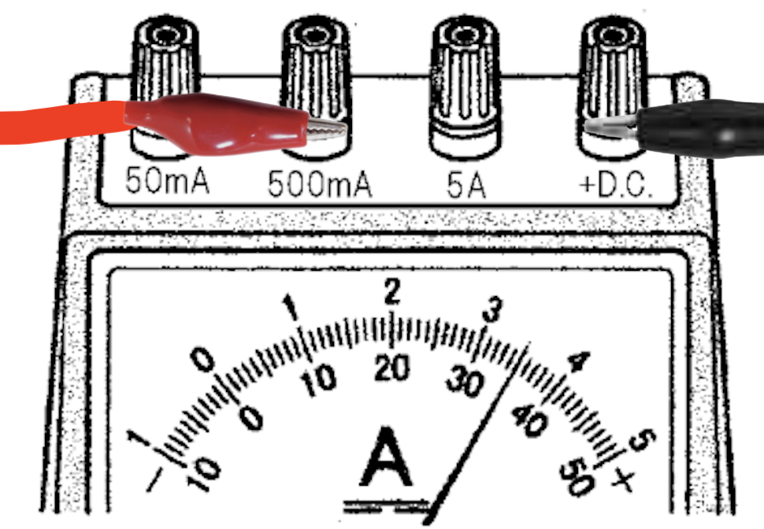](href "電流計500mA")
[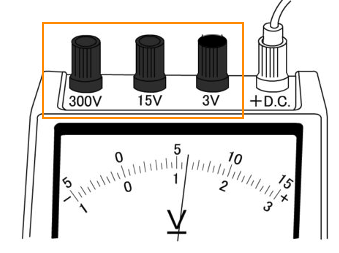](href "電圧計オレンジ四角")
[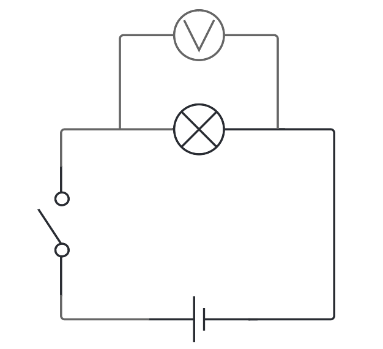](href "電圧計回路図")
[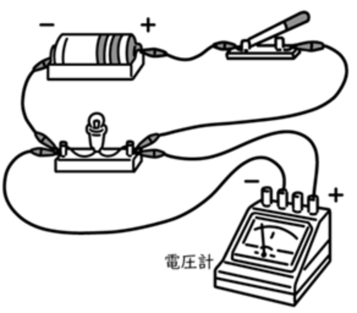](href "電圧計豆電球")
[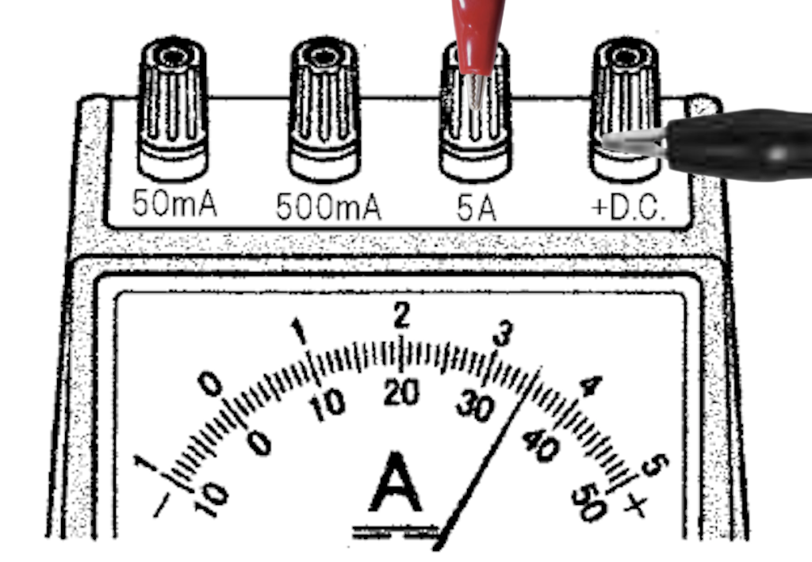](href "電流計5A")
[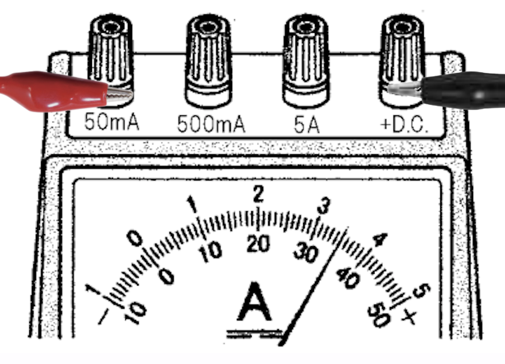](href "電流計50mA")
[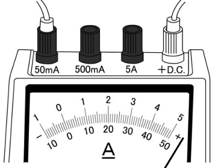](href "電流計")
[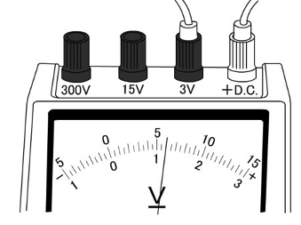](href "電圧計")
[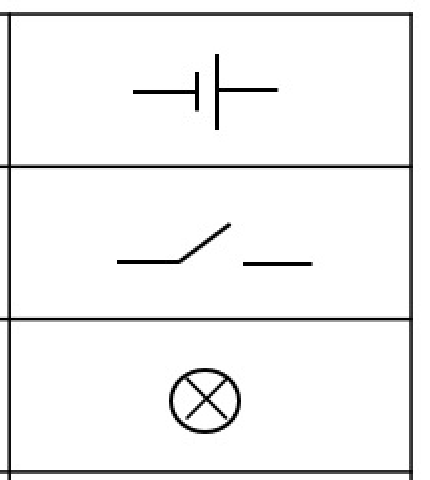](href "電気用図記号サンプル")

[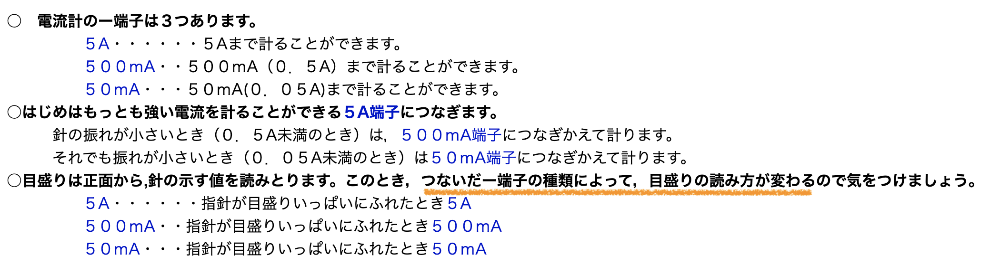](href "電流計使い方")
[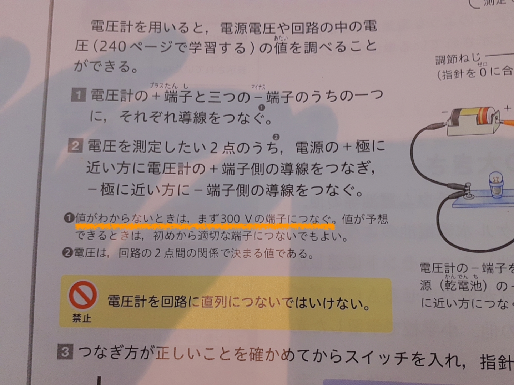](href "電圧計使い方")

[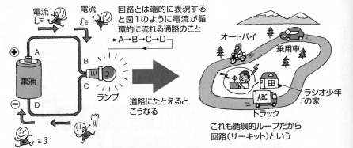](href "回路説明")
[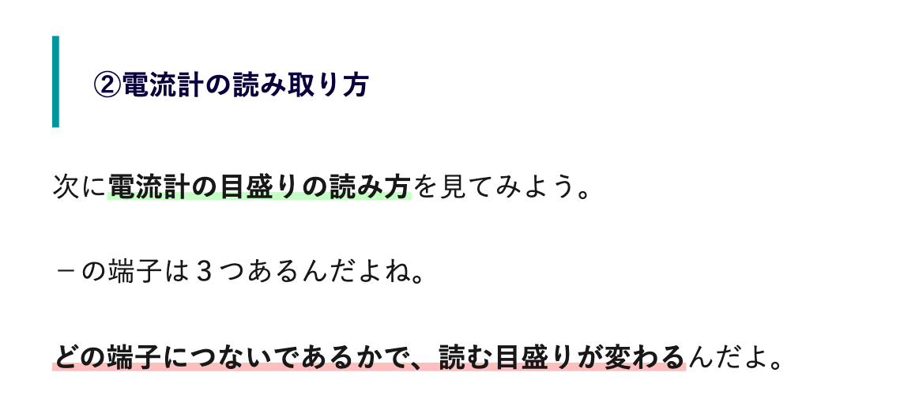](href "電流計マイナス端子")

[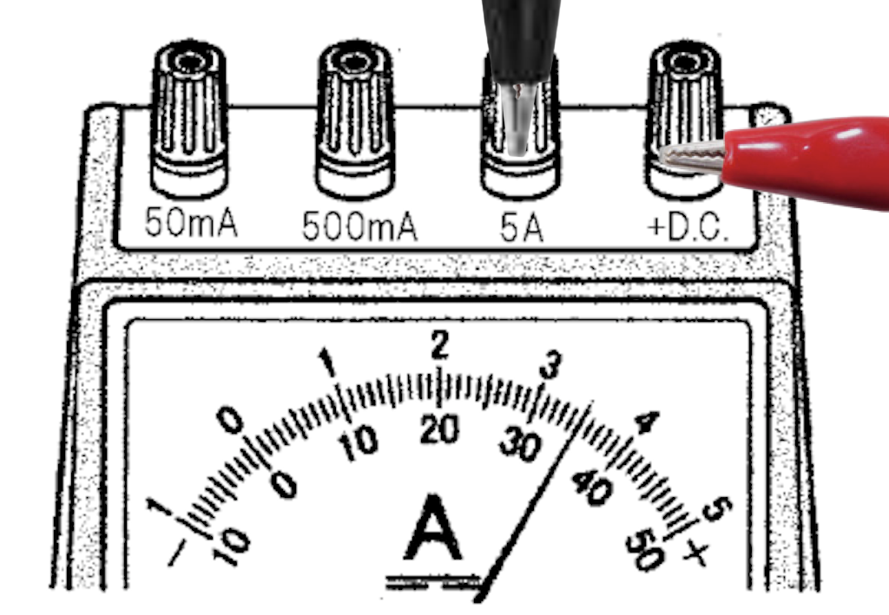](href "1")
[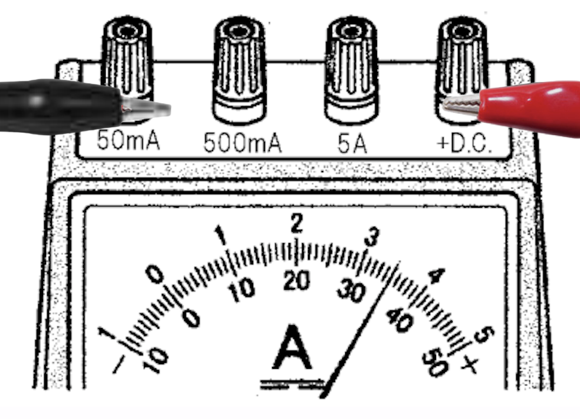](href "2")
[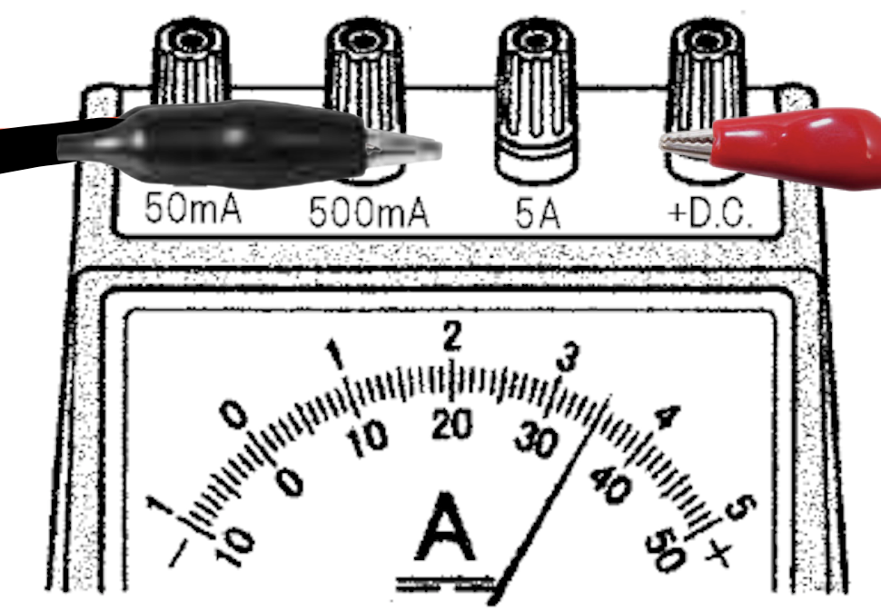](href "3")
